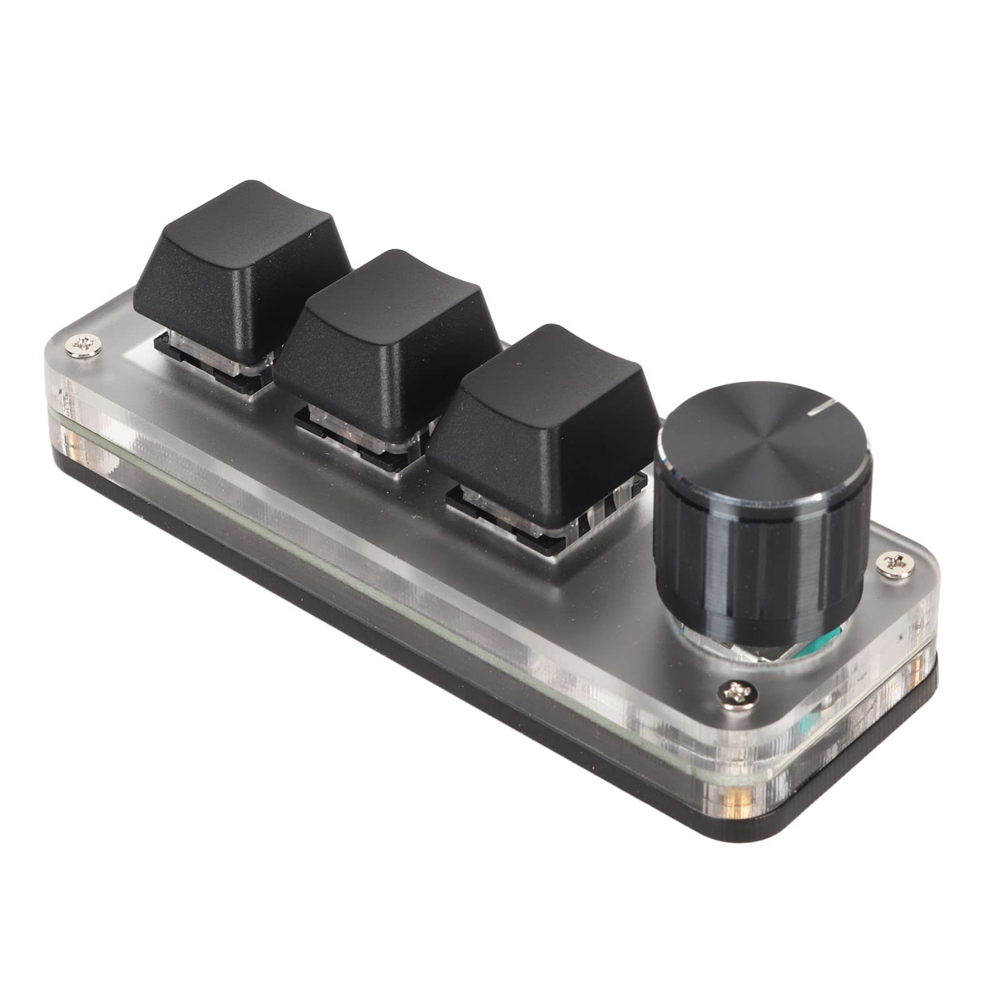

# MacroPad Studio

**macOS configuration manager for the CH57x 3-key + 1-knob USB macro pad**



> **The hardware:** this is the popular, inexpensive **3-key mechanical macro keypad with a rotary knob** widely sold on **AliExpress, Amazon, eBay, Temu and Banggood** (often listed as *"3 Key Custom Keyboard RGB Macro Pad"*, *"Mini Programmable Knob Keyboard"*, *"OSU! Macro Pad"* or *"DIY Hot-swap Keypad"*). Internally it uses a **CH57x** chip and enumerates as USB `0x1189:0x8890`. The bundled software is **Windows-only** — this project lets you configure it natively on **macOS**.

---

## What it does

This project gives macOS users full control over a compact USB macro pad based on the CH57x chip (VID `0x1189` / PID `0x8890`). The device ships with a Windows-only configuration utility. This repository provides:

- A library of **150+ ready-to-use YAML presets** covering apps from video editors to DAWs, browsers, coding tools, photo editors, and more.
- A **CustomTkinter GUI** (`app/macropad_studio.py`) that lets you browse, edit, record key bindings, and upload presets — no terminal required.
- Shell **helper scripts** for installation, verification, and one-command uploads.

---

## How the tool integration works

Presets are plain **YAML files** that describe what each of the three buttons and the rotary knob (counter-clockwise / press / clockwise) should send.

```
presets/
  video/
    final-cut-pro.yaml   ← one preset per app / workflow
  dev/
    vscode-edit.yaml
  ...
```

Uploading a preset is a one-liner that pipes the YAML into `ch57x-keyboard-tool`, an open-source Rust CLI that speaks the device's USB HID protocol and writes the key mappings directly into the firmware:

```bash
sudo ~/.cargo/bin/ch57x-keyboard-tool upload < presets/video/final-cut-pro.yaml
```

`sudo` is required because macOS restricts raw USB HID access to root.

The GUI wraps that same command behind a native macOS administrator-password dialog (via `osascript`), so you never have to open a terminal. It also provides a live **key recorder** — press any key combination on your keyboard and the GUI captures it in the correct token format.

---

## Quickstart

### 1. Install dependencies

```bash
bash scripts/install.sh
```

This installs `libusb` via Homebrew, `ch57x-keyboard-tool` via Cargo, and the Python packages needed by the GUI. It also runs a self-check at the end.

> **Rust required.** If Cargo is not found, the script will print the one-liner to install Rust via `rustup`. Re-run `install.sh` after Rust is set up.

### 2. Plug in the macro pad

Use a **data-capable USB cable** (charge-only cables are the most common cause of "device not detected" — see [docs/GUIDE.md](docs/GUIDE.md)).

### 3. Open the GUI

```bash
python3 app/macropad_studio.py
```

---

## GUI features

| Feature | Description |
|---|---|
| **Launcher** | Browse all preset categories and upload with one click |
| **Editor** | Edit button and knob bindings for any preset in a visual form |
| **Key recorder** | Press any shortcut on your keyboard — it is captured and normalised automatically |

---

## CLI usage

Upload a preset directly from the terminal:

```bash
# By path
sudo ~/.cargo/bin/ch57x-keyboard-tool upload < presets/dev/vscode-edit.yaml

# Using the helper script (finds the file by name, handles sudo)
bash scripts/upload.sh vscode-edit
```

Validate all presets (dry-run, no device needed):

```bash
bash scripts/verify.sh
```

---

## Preset categories

| Category | Presets | Example apps |
|---|---|---|
| `3d-cad` | 13 | Blender, AutoCAD, Fusion 360, Maya, ZBrush |
| `audio-daw` | 14 | Logic Pro, Ableton, Pro Tools, Reaper, GarageBand |
| `browser` | 9 | Chrome, Safari, Firefox, Arc, Brave |
| `communication` | 12 | Zoom, Slack, Teams, Discord, FaceTime |
| `design` | 12 | Figma, Photoshop, Illustrator, Sketch, Canva |
| `dev` | 19 | VS Code (7 modes), Xcode, Neovim, Cursor, iTerm |
| `music-notation` | 5 | Dorico, Sibelius, Finale, MuseScore |
| `office` | 15 | Word, Excel, Keynote, Notion, Obsidian, Pages |
| `photo` | 19 | Lightroom, Capture One, Darktable, GIMP, Affinity Photo |
| `reading-pdf` | 6 | Preview, Skim, Adobe Acrobat, Apple Books |
| `streaming` | 7 | OBS Studio, Ecamm Live, Streamlabs, Twitch |
| `system-macos` | 13 | Screenshots, Mission Control, Media, Finder, Spotlight |
| `utility` | 10 | Clipboard, Emoji, Window snapping, 1Password |
| `video` | 21 | Final Cut Pro, DaVinci Resolve (6 modes), Premiere Pro, After Effects |

Full binding details for every preset: [docs/PRESETS.md](docs/PRESETS.md)

---

## Documentation

- [docs/GUIDE.md](docs/GUIDE.md) — hardware identification, install walkthrough, YAML editing reference, knob behaviour, troubleshooting
- [docs/PRESETS.md](docs/PRESETS.md) — complete binding tables for all presets, auto-generated from the YAML files

---

## Credits

- **[ch57x-keyboard-tool](https://github.com/kriomant/ch57x-keyboard-tool)** by kriomant — the open-source Rust CLI that makes USB communication possible on macOS and Linux.
- **[libusb](https://libusb.info/)** — low-level USB library, installed via Homebrew.

---

## License

MIT — see [LICENSE](LICENSE).  
Author: Fabio Dal Ez
